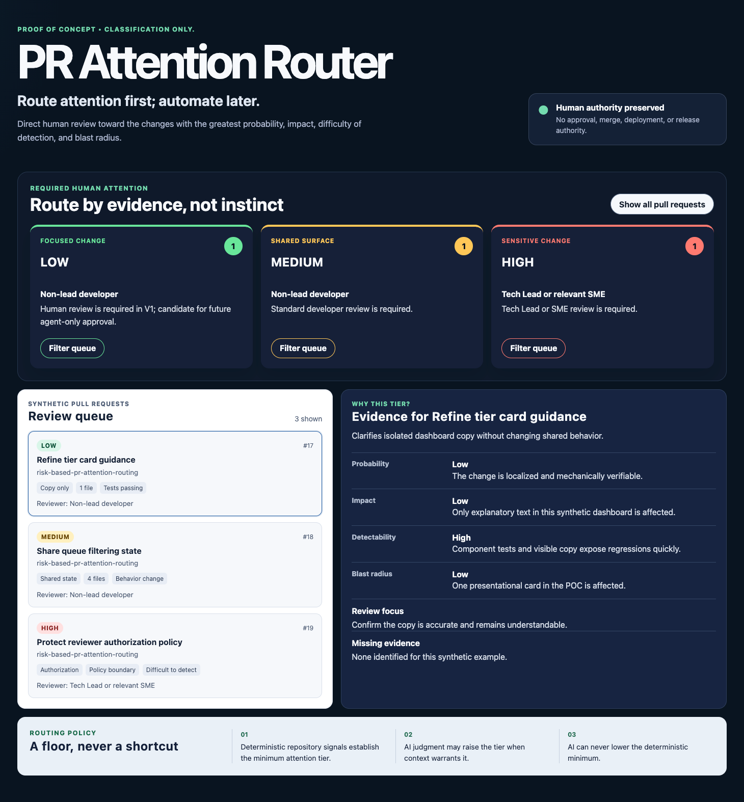

# Risk-Based PR Attention Routing

> Route attention first; automate later.

V1 classifies and notifies only. It does not approve, merge, deploy, or release
pull requests.

## Problem

AI increases pull-request throughput faster than it increases human review
capacity. This proof of concept tests whether repository evidence and AI
judgment can direct scarce human attention toward the changes where it matters
most.

## V1: Attention Router

The router evaluates four distinct dimensions:

- **Probability** — How likely is the change to be wrong?
- **Impact** — How severe are the consequences if it is wrong and nobody
  notices?
- **Detectability** — How likely are tests, CI, monitoring, or other controls
  to catch it?
- **Blast radius** — How broadly could the failure propagate across users,
  applications, systems, or One SEO capabilities?

Impact answers “how bad?” Blast radius answers “how far?”

Deterministic repository signals establish the minimum attention tier. AI may
raise that tier when business context warrants it, but it may never lower the
deterministic floor.

## Attention Tiers

### Low: Lightweight Human Review

Examples:

- Localized UI, copy, style, or accessibility changes
- User-facing documentation
- Developer documentation or runbook updates that do not change operational
  policy or executable configuration
- Isolated component changes with no shared contracts or business logic

**Reviewer:** A developer familiar with the affected area.

### Medium: Targeted Human Review

Examples:

- Shared components
- Routing or navigation
- GraphQL or API consumers
- Meaningful query changes
- Changes spanning multiple One SEO features
- Dependency, migration, or build configuration
- `.github/workflows` changes limited to CI checks, tests, linting, or other
  non-deployment automation

**Blast radius:** Multiple consumers, workflows, or features could be
affected.

**Review focus:** Identify the specific areas that require reviewer attention.

**Reviewer:** A non-lead developer.

### High: Tech Lead or SME Review

Examples:

- Sitemap eligibility or indexability
- Metadata publishing or delivery
- Authorization or security
- Shared API or event contracts
- Persistence, schemas, or migrations
- Destructive or difficult-to-reverse changes
- `.github/workflows` changes affecting deployment, release, publishing,
  permissions, secrets, OIDC, credentials, or other security-sensitive
  automation
- Runbook or documentation changes that alter operational, security, or
  production procedures

**Blast radius:** Core business behavior, data integrity, production
operations, security, or many consumers or pages could be affected.

**Reviewer:** A Tech Lead or relevant subject-matter expert.

## Signals and Context

The deterministic floor uses available repository signals:

- Changed paths, rename origins, and change size
- Module and consumer blast radius
- Tests, coverage, and validation results
- Dependencies, contracts, and configuration
- Security-sensitive workflow and automation paths

The router also uses available Jira, specification, ADR, and pull-request
context to understand intent and business meaning. Pull requests declare that
state with a structured body field:

```text
Material context: SUFFICIENT
```

Use `CONFLICTING` when the supplied context disagrees with the change. An
absent field is treated as `MISSING`. Missing Jira context alone does not
prevent LOW when the pull request otherwise supplies enough evidence, but
missing or conflicting material context establishes at least a MEDIUM floor.

## GitHub Actions Flow

```text
Pull request opened or updated
             |
             v
Validate repository
  lint + type-check + test + build + whitespace
             |
             v
Collect deterministic evidence and floor
             |
             v
openai/codex-action (read-only)
             |
             v
Enforce deterministic floor
             |
             v
LOW / MEDIUM / HIGH
  + rationale
  + blast radius
  + review focus
  + recommended reviewer
  + missing evidence
             |
             v
Persistent PR comment
  + optional change-only email
  + optional change-only Slack message
             |
             v
Human review and decision
```

The workflows run separately:

- `Validate repository` runs linting, type-checking, tests, a production build,
  and whitespace validation.
- `PR Attention Review` runs after validation succeeds or fails, so failed
  validation can raise the deterministic floor. It collects evidence, requests
  structured read-only Codex judgment, enforces the floor, and updates one
  persistent PR comment.
- `Local runner smoke test` verifies the self-hosted runner independently of
  the application.

The personal POC runs on a self-hosted macOS ARM64 runner. Codex uses the
action’s built-in `read-only` safety strategy. The eventual work-repository
integration must use its approved enterprise runner and credential controls
rather than copying local-runner lifecycle choices.

## Notifications

The persistent PR comment is the classification source of truth. Email and
Slack notifications are optional and change-only: they send for the first
classification or when the tier changes, not for same-tier updates. Delivery
failures do not block publication of the PR comment.

- Email uses repository-configured SMTP settings. LOW and MEDIUM route to
  `PAR_EMAIL_TO_TEAM`; HIGH routes to `PAR_EMAIL_TO_LEAD`.
- Slack uses `SLACK_BOT_TOKEN`, `PAR_SLACK_CHANNEL_ID`, and the Web API
  `chat.postMessage` method.
- `PAR_EMAIL_ENABLED` and `PAR_SLACK_ENABLED` independently gate delivery.

Notifications do not grant approval, merge, deployment, release, or source
modification authority.

## POC Success Criteria

- Classify representative LOW, MEDIUM, and HIGH pull requests.
- Compare router output with human judgment and record false positives and
  false negatives.
- Favor conservative over-classification while treating under-classification
  as the more serious failure.
- Validate the persistent comment and optional notification paths without
  expanding the router’s authority.

Automated approval or merge may be considered only after the proof of concept
establishes feedback loops, observability, and sufficient evidence to trust a
broader automation boundary.

## Sandbox Boundaries

- Keep POC workflows, secrets, test pull requests, and run history in the
  isolated `risk-based-pr-attention-routing`, `one-seo-par`, and
  `one-market-par` repositories.
- Treat V1 as source-code read-only. Its only writes are the persistent PR
  classification comment and enabled attention notifications.
- Keep approval, merge, deployment, and release decisions under human control.
- Keep the POC isolated from the real `one-seo` frontend and `one-market`
  backend repositories until the approach is validated.

## Run the Attention Router App

The standalone React and TypeScript app provides controlled LOW, MEDIUM, and
HIGH examples for local testing.

```bash
cd apps/attention-router
npm ci
npm run dev -- --port 5157
```

Then open <http://localhost:5157>. Useful checks are:

```bash
npm run lint
npm run typecheck
npm test
npm run build
```

## Documentation

- [ADR-0001: Route attention before automating pull request decisions](docs/adr/ADR-0001-route-attention-before-automation.md)
- [Local GitHub Actions runner runbook](docs/runbooks/local-actions-runner.md)
- [PR attention notification runbook](docs/runbooks/pr-attention-notification.md)
- [Personal Mac POC build prompt](docs/personal-mac-poc-build-prompt.md)

## Attention Router Dashboard


