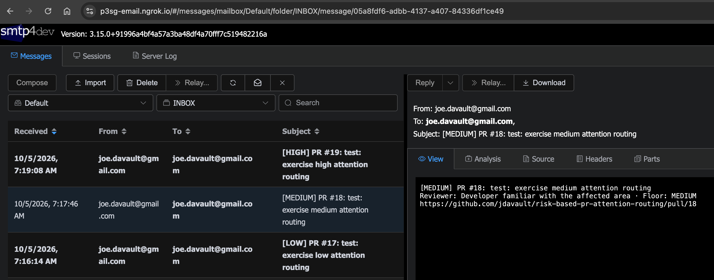
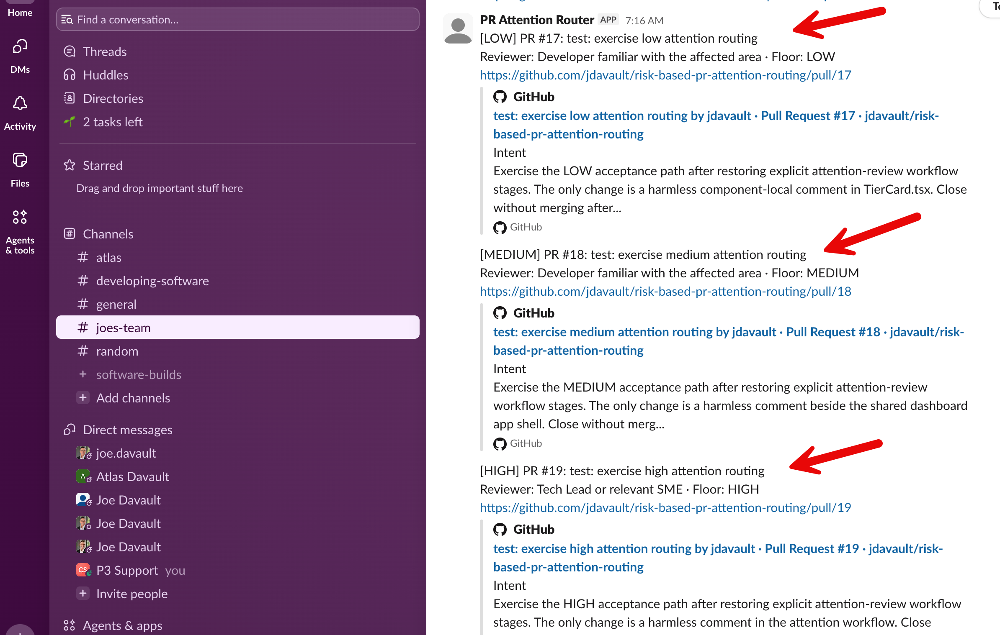

# PR Attention Routing Acceptance Results

Date: 2026-10-05

All three acceptance pull requests completed successfully. Every explicit
workflow stage passed, including email, Slack, and persistent comment
publication.

| Pull request | Deterministic floor | AI judgment | Final tier |
| --- | --- | --- | --- |
| [#17 LOW](https://github.com/jdavault/risk-based-pr-attention-routing/pull/17) | LOW | LOW | **LOW** |
| [#18 MEDIUM](https://github.com/jdavault/risk-based-pr-attention-routing/pull/18) | MEDIUM | MEDIUM | **MEDIUM** |
| [#19 HIGH](https://github.com/jdavault/risk-based-pr-attention-routing/pull/19) | HIGH | HIGH | **HIGH** |

## Notification evidence

The smtp4dev capture shows the change-only email alerts for all three
acceptance tiers. The selected MEDIUM message demonstrates the deliberately
thin notification format: tier and title, reviewer and deterministic floor,
and the pull-request link. Detailed reasoning remains in the persistent GitHub
comment.

The Slack capture shows the corresponding LOW, MEDIUM, and HIGH alerts in the
team channel, using the same compact notification contract.

## PR #17 — LOW

**Change:** One component-local comment in `TierCard.tsx`.

### Deterministic rationale

- No configured path rule matched.
- Validation passed.
- The change was below the 250-line threshold.
- Therefore, the default floor remained LOW.

### AI rationale

- Only a local explanatory comment changed.
- No executable behavior or shared contracts changed.
- It did not affect routing, policy, CI, credentials, or external
  destinations.
- The impact is readily detectable and limited to one component.

**Result:** `max(LOW floor, LOW AI) = LOW`

[Workflow run](https://github.com/jdavault/risk-based-pr-attention-routing/actions/runs/37323191893)

## PR #18 — MEDIUM

**Change:** One harmless comment beside the shared dashboard `App` component.

### Deterministic rationale

- `apps/par-dashboard/src/App.tsx` matched the
  `dashboard-shared-surfaces` rule.
- That rule guarantees MEDIUM because a broken dashboard shell or shared
  model could affect multiple views.

### AI rationale

- The change was comment-only and did not alter executable behavior.
- No credential handling, workflow changes, external destinations, or
  classification behavior justified HIGH.
- Codex agreed that the shared-surface path requires MEDIUM attention.

**Result:** `max(MEDIUM floor, MEDIUM AI) = MEDIUM`

[Workflow run](https://github.com/jdavault/risk-based-pr-attention-routing/actions/runs/37323398441)

## PR #19 — HIGH

**Change:** One YAML comment in `pr-attention-review.yml`.

### Deterministic rationale

- `.github/workflows/pr-attention-review.yml` matched the `ci-workflows`
  rule.
- Every workflow change receives a HIGH floor because a mistake could bypass
  validation, weaken secret isolation, or disrupt attention routing.

### AI rationale

- Codex recognized that the actual change was only a comment and did not alter
  triggers, jobs, permissions, credentials, or routing.
- Nevertheless, it agreed that the repository rubric and supplied
  deterministic floor require HIGH for workflow paths.

**Result:** `max(HIGH floor, HIGH AI) = HIGH`

[Workflow run](https://github.com/jdavault/risk-based-pr-attention-routing/actions/runs/37323577674)

## Outcome

The acceptance probes demonstrate the intended contract:

1. Deterministic rules establish a minimum tier from known repository paths
   and hard signals.
2. Codex evaluates what the change actually does using the repository rubric.
3. Codex may raise the tier but cannot lower the deterministic floor.
4. The final tier is `max(deterministic floor, AI judgment)`.
5. Detailed reasoning remains in the persistent pull-request comment; email
   and Slack receive the short notification summary.

The three probe pull requests are intentionally open and unmerged pending
cleanup.
